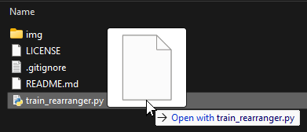

# Satisfactory Train Rearranger
A tool to rearrange the order of Train Stations and Trains in the Time Table menu by editing the save file.
Currently updated for at least Update 1.0, v1.0.0.3 (build 368883).

## The problem
The Stations in the Time Table menu are ordered by the time they were built,
and when an older Station is destroyed, the Station at the bottom of the list (the newest) will jump up in the list to take the destroyed station's place.
When building a larger rail network, this can lead to some pretty nasty and unorganised lists.

Or perhaps you'd like some stations to be at the top of the list because they're used more often. Like an on-demand Train Mall system.

Satisfactory currently does not have a way of changing the order of Stations and Trains, which is why I wrote this tool!

## What this tool can do
- Change the order in which the Stations and Trains appear in the Time Table menu.

## What this tool can not do
- Edit the names of Stations and Trains.
- Remove or add Stations/Trains.
- Change the order in which Stations and Trains appear in the Map's menu.
- Do anything with non-train vehicles.

## Usage
1. Download the latest `train_rearranger.exe` from the [Release page](https://github.com/SimonvBez/SatisfactoryTrainRearranger/releases/).
(Some antiviruses might not like this. Create an exception, or consider to run from source instead of using the release .exe)
   - If you rather run from source instead of downloading a release, download and install [Python](https://www.python.org/downloads/) and download [train_rearrenger.py](./train_rearranger.py) from this repo.
2. In file explorer, drag and drop your savefile onto the `train_rearrenger.exe/py` file.

3. Two text files will be created: `station list.txt` and `train list.txt`. Read the program's instructions and edit the files to your liking.

4. Don't forget to save the text files!
5. Press Enter in the program's window to read the new orders from the files. If no names are missing, misspelled or duplicated a new save file will be generated.
6. Put the new save file in Satisfactory's SaveGames folder and enjoy!

## FAQ
- What if I mess up one of the text files (like if I misspelled or missed a name)?
  - The program will check that your text file is correct and informs you if something is wrong.
A new save file will only be generated if both text files contain all of the names.
- Does this work with mods?
  - I have only used this on a vanilla save, but my guess is probably! Make a backup of your original save just in case though.
- What if I have several Stations/Trains of the same name?
  - No worries! Though they can only stay in the same relative order. Meaning if you have 2 Trains named "ChooChoo", the first "ChooChoo" in the old list will always be the first "ChooChoo" in the new list, second the second, etc.
- Does rearranging the Stations mess with any of the Self-Driving Trains?
  - No, all Trains will continue working as intended. This tool only changes the Time Table's visual list order.
- Does this tool work with several separated rail networks?
  - Yes, it'll work. If you have separate rail networks it will put all Stations and Trains into the same text file, but the game will still know that they are separate networks.
- Will you make a version with a proper user interface?
  - I have no plans for it, this currently works well enough for me. Feel free to fork and improve it though!
