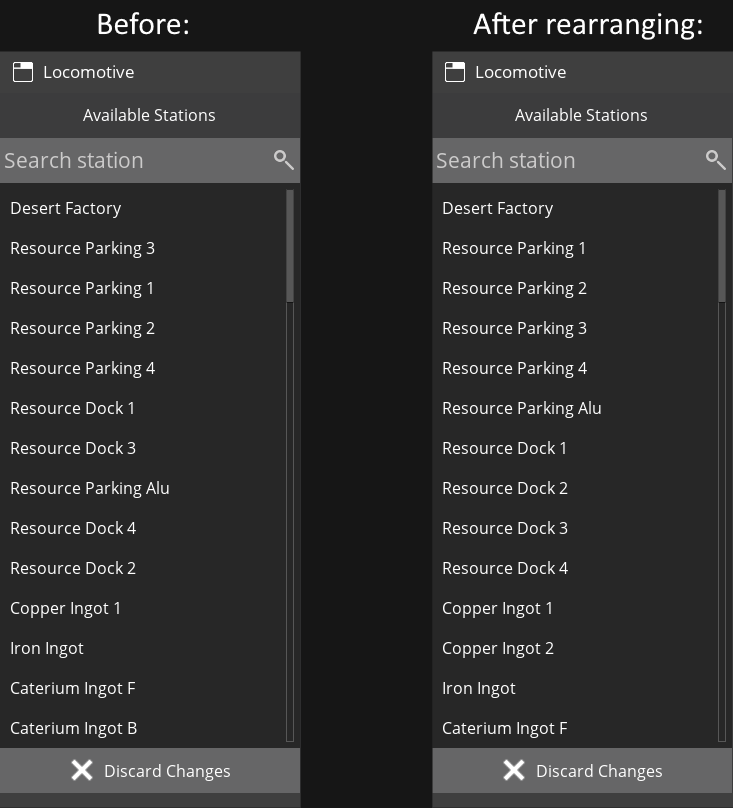
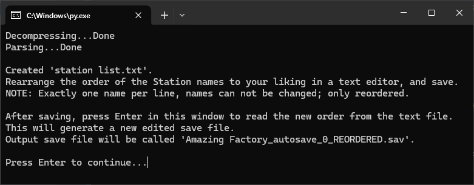

# Satisfactory Train Rearranger
A tool to rearrange the order of Train Stations and Trains in the Time Table menu by editing the save file.

## The problem
The Stations in the Time Table menu are ordered by the time they were built,
and when an older Station is destroyed, the Station at the bottom of the list (the newest) will jump up in the list to take its place.
When building a larger rail network this can lead to some pretty nasty and unorganised lists.

Or perhaps you'd like some stations to be at the top of the list because they're used more often. Like an on-demand Mall Train system.

Satisfactory currently does not have a way of changing the order of Stations and Trains, which is why I wrote this tool!

## What this tool can do
- Change the order in which the Stations and Trains appear in the Time Table menu.

## What it can not do
- Edit the names of Stations and Trains.
- Remove or add Stations/Trains
- Change the order in which Stations and Trains appear in the Map's menu.
- Do anything with non-train vehicles.

## Usage
1. Download and install [Python](https://www.python.org/downloads/), to be able to run the script.
2. Download train_rearrenger.py from this repo.
3. In file explorer, drag and drop your savefile onto the train_rearrenger.py file.
4. Two text files will be created: `station list.txt` and `train list.txt`. Read the program's instructions and edit the files to your liking.

5. Don't forget to save the text files!
6. Press any key in the program's window to read the new orders from the files. If no names are missing, misspelled or duplicated a new save file will be generated.
7. Put the new save file in Satisfactory's SaveGames folder and enjoy!

## FAQ
- What if I mess up one of the text files (like if I misspelled or missed a name)?
  - The program will check that your text file is correct and informs you if something is wrong.
A new save file will only be generated if both text files contain all of the names.
- Does this work with mods?
  - I have only used this on a vanilla save, but my guess is probably! Make a backup of your original save just in case though.
- What if I have several Stations/Trains of the same name?
  - No worries! They will stay in the same order. (If you have 2 Trains named "Train", the first "Train" in the list will remain the first.)
- Will you make a version with a proper user interface?
  - I have no plans for it, this currently works well enough for me. Feel free to fork and improve it though!
